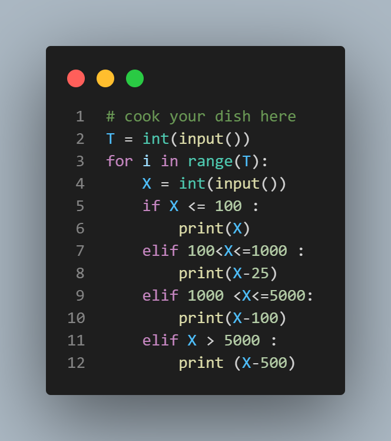

# Sale Season

It's the sale season again, and Chef bought items worth a total of ₹X rupees. The sale season offer is as follows:

- If ₹X ≤ 100, no discount.
- If 100 < ₹X ≤ 1000, discount is ₹25.
- If 1000 < ₹X ≤ 5000, discount is ₹100.
- If ₹X > 5000, discount is ₹500.

Find the final amount Chef needs to pay for his shopping.

## Input Format

The first line of input contains a single integer T, denoting the number of test cases.
Each test case consists of a single line of input containing an integer ₹X.

## Output Format

For each test case, output on a new line the final amount Chef needs to pay for his shopping.

## Constraints

1 ≤ T ≤ 100
1 ≤ ₹X ≤ 10000

## Sample Input

```
4
15
70
250
1000
```

## sample output

```
15 
70
225
975

```

## Explanation

- Test case 1: Since ₹X ≤ 100, there is no discount.
- Test case 3: Here, ₹X = 250. Since 100 < 250 ≤ 1000, a discount of ₹25 applies. Therefore, Chef needs to pay 250 − 25 = 225 rupees.


