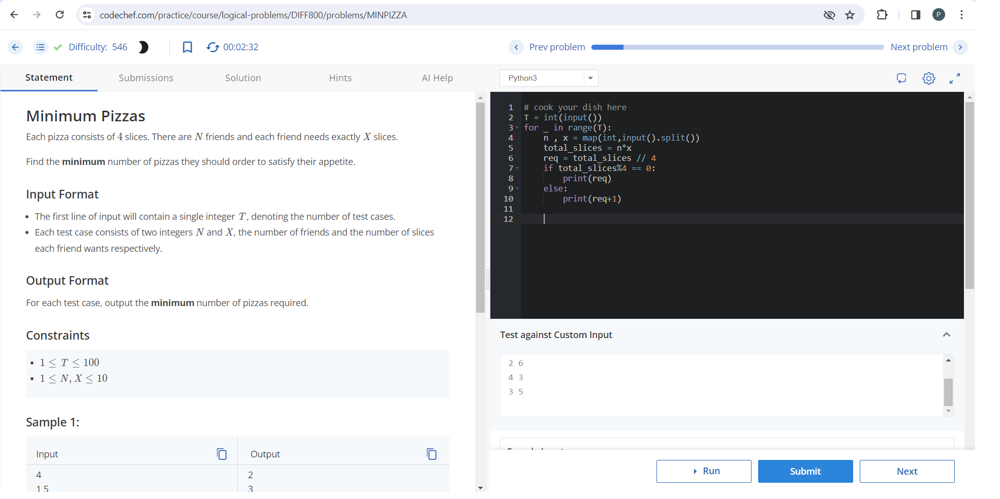
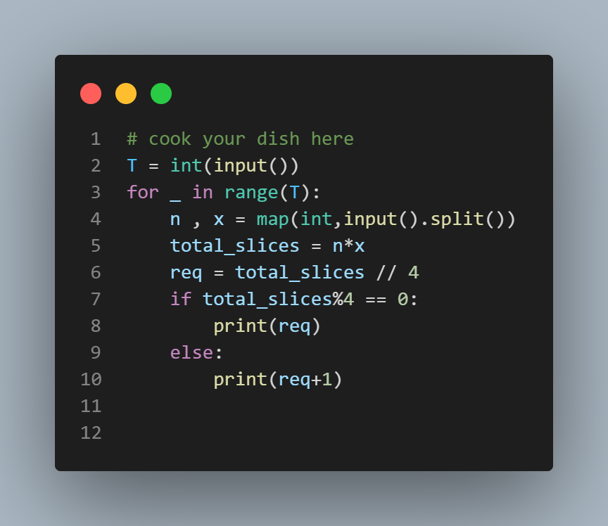

# Minimum Pizzas

## Problem Description
Each pizza consists of 4 slices. There are N friends and each friend needs exactly X slices. Find the minimum number of pizzas they should order to satisfy their appetite.

## Input Format
The first line of input will contain a single integer T, denoting the number of test cases. Each test case consists of two integers N and X, the number of friends and the number of slices each friend wants respectively.

## Output Format
For each test case, output the minimum number of pizzas required.

## Constraints
- 1 ≤ T ≤ 100
- 1 ≤ N, X ≤ 10

## Sample Input
```4
1 5
2 6
4 3
3 5
```
## sample output

```
2
3
3
4
```

## Test Cases Explanation

### Test Case 1:
There is only 1 friend who requires 5 slices. If he orders 1 pizza, he will get only 4 slices. Thus, at least 2 pizzas should be ordered to have the required number of slices.

### Test Case 2:
There are 2 friends who require 6 slices each. Thus, a total of 12 slices are required. To get 12 slices, they should order 3 pizzas.

### Test Case 3:
There are 4 friends who require 3 slices each. Thus, a total of 12 slices are required. To get 12 slices, they should order 3 pizzas.

### Test Case 4:
There are 3 friends who require 5 slices each. Thus, a total of 15 slices are required. To get 15 slices, they should order at least 4 pizzas.


