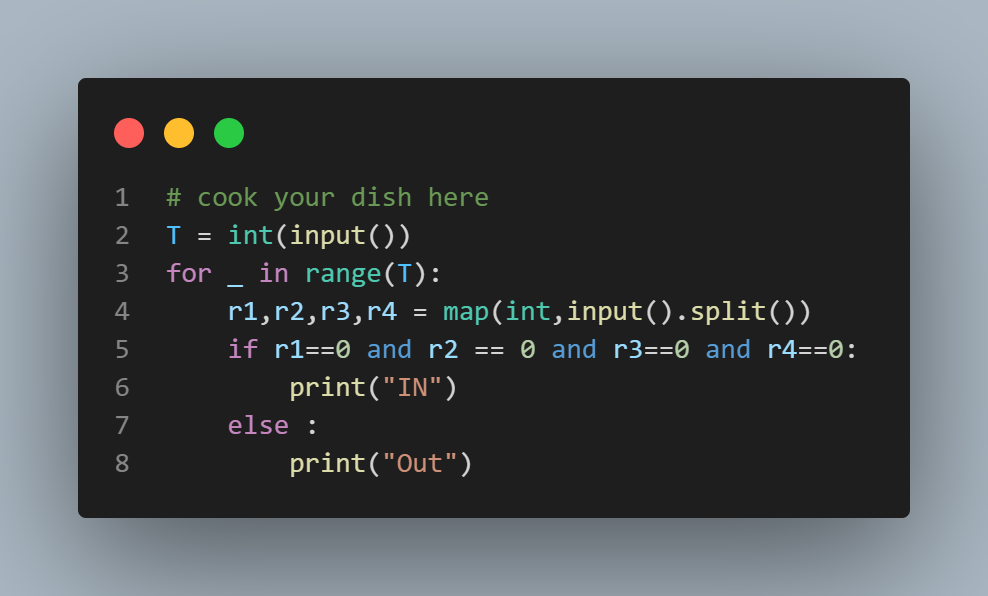

# Chefland Games

## Problem Description
In Chefland, a tennis game involves 4 referees. Each referee has to point out whether he considers the ball to be inside limits or outside limits. The ball is considered to be IN if and only if all the referees agree that it was inside limits.

Given the decision of the 4 referees, help Chef determine whether the ball is considered inside limits or not.

## Input Format
The first line of input contains a single integer T, denoting the number of test cases. Each test case consists of a single line containing 4 integers R1, R2, R3, R4, where Ri (0 <= Ri <= 1) denotes the decision of the ith referee.

## Output Format
For each test case, output "IN" if the ball is considered to be inside limits by all referees, and "OUT" otherwise.

## Constraints
- 1 <= T <= 20
- 0 <= Ri <= 1

## Sample Input
```
4
1 1 0 0
0 0 0 0
0 0 0 1
1 1 1 1

```

## sample output
```
OUT
IN
OUT
OUT
```


## Explanation
- Test case 1: Referees 1 and 2 do not consider the ball to be IN. Thus, the ball is OUT.
- Test case 2: All referees consider the ball to be IN. Thus, the ball is IN.
- Test case 3: Referee 4 does not consider the ball to be IN. Thus, the ball is OUT.
- Test case 4: No referee considers the ball to be IN. Thus, the ball is OUT.
 
 