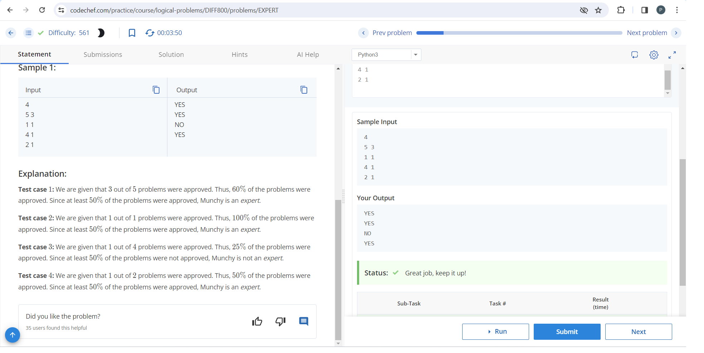
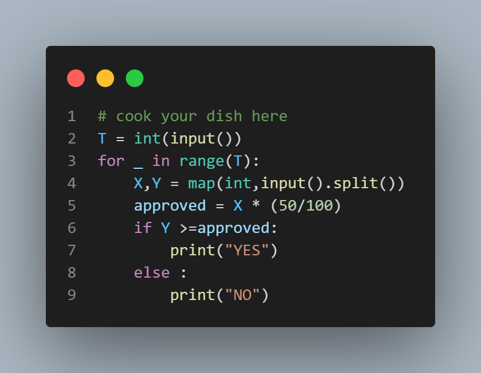

# Expert Setter Problem

## Description

Munchy, a problem setter, is considered an expert if at least 50% of their problems are approved by Chef. Given the number of problems submitted by Munchy and the number of problems approved by Chef for each submission, determine whether Munchy is an expert or not.

## Input Format

The input consists of multiple test cases. Each test case is represented by a single line containing two space-separated integers: X and Y, where:
- X represents the number of problems submitted by Munchy.
- Y represents the number of problems approved by Chef.

## Output Format

For each test case, output "YES" if Munchy is considered an expert, otherwise output "NO". The output is case-insensitive.

## Constraints

- 1 ≤ T ≤ 1000 (number of test cases)
- 1 ≤ X ≤ 10^6 (number of problems submitted)
- 1 ≤ Y ≤ X (number of problems approved)

## Sample Input
```
4
5 3
1 1
4 1
2 1

```

## sample output

```

YES
YES
NO
YES


```


## Explanation

- Test case 1: Munchy submitted 5 problems, and 3 of them were approved. Since 3 out of 5 is more than 50%, Munchy is considered an expert.
- Test case 2: Munchy submitted 1 problem, and it was approved. 100% of Munchy's problem was approved, so Munchy is considered an expert.
- Test case 3: Munchy submitted 4 problems, but only 1 was approved. Since less than 50% of Munchy's problems were approved, Munchy is not considered an expert.
- Test case 4: Munchy submitted 2 problems, and 1 was approved. 50% of Munchy's problems were approved, so Munchy is considered an expert.


