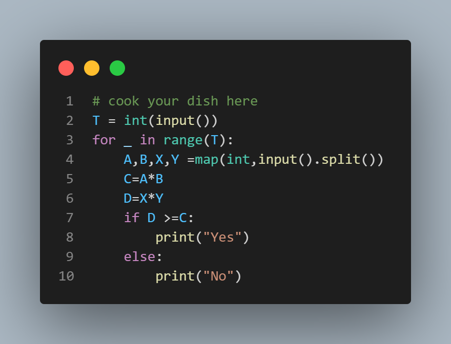

# Chef and NextGen

## Description

Chef is working for a secret research group called NEXTGEN, which has achieved significant milestones in utilizing Helium-3 as a fuel for nuclear reactors. The project requires government funding under the condition that it must power Chefland by generating at least A units of power each year for the next B years. Help Chef determine whether the group will get funded based on the amount of Helium-3 available on the moon and its power generation capacity.

## Input Format

The input consists of T test cases, where each test case is represented by a single line containing four space-separated integers: A, B, X, and Y, where:
- A represents the required units of power per year.
- B represents the number of years the power needs to be generated for.
- X represents the grams of Helium-3 available on the moon.
- Y represents the units of power generated by 1 gram of Helium-3.

## Output Format

For each test case, print "Yes" if NEXTGEN satisfies the government's minimum requirements for funding and "No" otherwise. The output is case-insensitive.

## Constraints

- 1 ≤ T ≤ 1000 (number of test cases)
- 1 ≤ A, B, X, Y ≤ 1000

## Sample Input
```
4
1 2 3 4
4 3 2 1 
2 18 9 4
1 100 2 49

```
## sample output

```
Yes
No
Yes
No
```

## Explanation

- Test case 1: NEXTGEN needs to generate 1 unit of power for the next 2 years. The available Helium-3 on the moon can generate 3 * 4 = 12 units of power, which is sufficient for funding.
- Test case 2: NEXTGEN needs to generate 4 * 3 = 12 units of power for the next 3 years. The available Helium-3 on the moon can generate 2 * 1 = 2 units of power, which is insufficient for funding.
- Test case 3: NEXTGEN needs to generate 2 * 18 = 36 units of power for the next 18 years. The available Helium-3 on the moon can generate 9 * 4 = 36 units of power, which is sufficient for funding.
- Test case 4: NEXTGEN needs to generate 1 * 100 = 100 units of power for the next 100 years. The available Helium-3 on the moon can generate 2 * 49 = 98 units of power, which is insufficient for funding.


