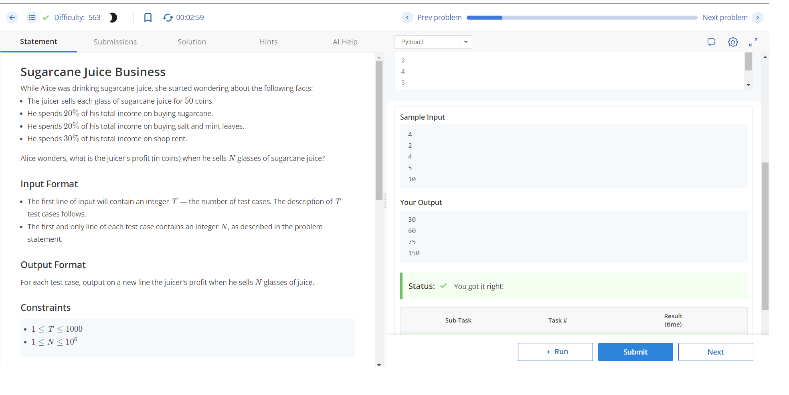
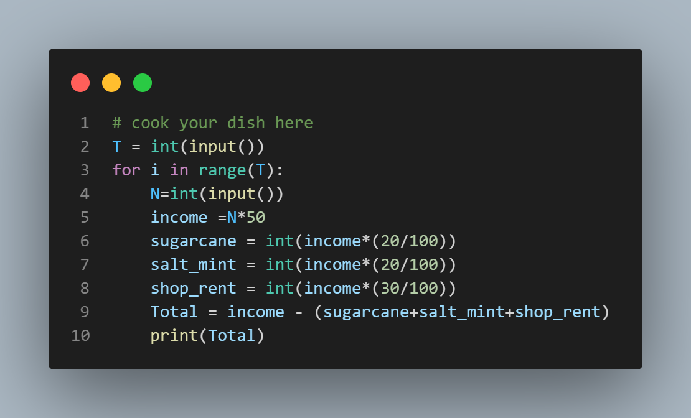

# Sugarcane Juice Business

## Description

Alice observed a juicer who sells glasses of sugarcane juice and started wondering about his profit. The juicer sells each glass of sugarcane juice for 50 coins. He spends 20% of his total income on buying sugarcane, 20% on buying salt and mint leaves, and 30% on shop rent. Alice wonders what the juicer's profit will be when he sells N glasses of sugarcane juice.

## Input Format

The input consists of T test cases, where each test case is represented by:
- The first line containing an integer T, the number of test cases.
- Each of the next T lines containing an integer N, representing the number of glasses of sugarcane juice sold.

## Output Format

For each test case, output the juicer's profit (in coins) when he sells N glasses of juice on a new line.

## Constraints

- 1 ≤ T ≤ 1000 (number of test cases)
- 1 ≤ N ≤ 10^6

## Sample Input
```
4
2
4
5
10
```
## sample output
```
30
60
75
150

```


## Explanation

- Test case 1: The juicer's total income is 50 * 2 = 100 coins. He spends 20 coins on sugarcane, 20 coins on salt and mint leaves, and 30 coins on rent. Thus, the profit is 100 - (20 + 20 + 30) = 30 coins.
- Test case 2: The juicer's total income is 50 * 4 = 200 coins. He spends 40 coins on sugarcane, 40 coins on salt and mint leaves, and 60 coins on rent. Thus, the profit is 200 - (40 + 40 + 60) = 60 coins.
- Test case 3: The juicer's total income is 50 * 5 = 250 coins. He spends 50 coins on sugarcane, 50 coins on salt and mint leaves, and 75 coins on rent. Thus, the profit is 250 - (50 + 50 + 75) = 75 coins.
- Test case 4: The juicer's total income is 50 * 10 = 500 coins. He spends 100 coins on sugarcane, 100 coins on salt and mint leaves, and 150 coins on rent. Thus, the profit is 500 - (100 + 100 + 150) = 150 coins.


