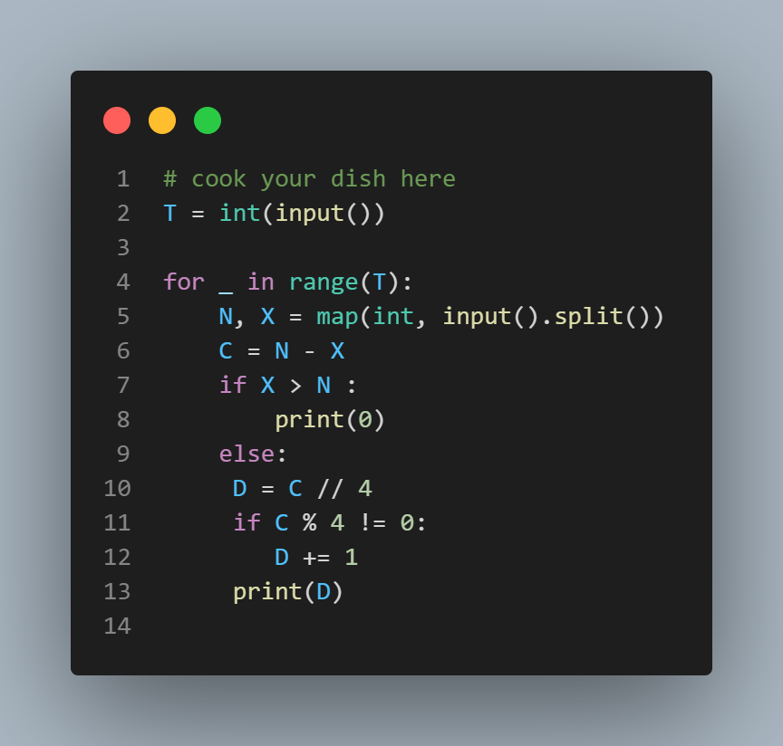

# Chef and Candies

## Description

Chef wants to give candies to N children. He already has X candies with him. To buy the rest, he visits a candy shop where packets containing exactly 4 candies are available. Determine the minimum number of candy packets Chef must buy so that he is able to give 1 candy to each of the N children.

## Input Format

The input consists of T test cases, where each test case is represented by:
- The first line containing an integer T, the number of test cases.
- Each of the next T lines containing two integers N and X, representing the number of children and the number of candies Chef already has, respectively.

## Output Format

For each test case, output the minimum number of candy packets Chef must buy so that he is able to give 1 candy to each of the N children.

## Constraints

- 1 ≤ T ≤ 1000 (number of test cases)
- 1 ≤ N, X ≤ 100

## Sample Input
```
4
20 12
10 100
10 9
20 9 
```
## sample output
```
2
0
1
3
```

## Explanation

- Test Case 1: Chef must buy 2 more packets, after which he will have 20 candies, enough to distribute 1 candy to each of the 20 children.
- Test Case 2: Chef does not need to buy more packets since he already has 100 candies, enough to distribute 1 candy to each of the 10 children.
- Test Case 3: Chef must buy 1 more packet, after which he will have 13 candies, enough to distribute 1 candy to each of the 10 children.
- Test Case 4: Chef must buy 3 more packets, after which he will have 21 candies, enough to distribute 1 candy to each of the 20 children.


