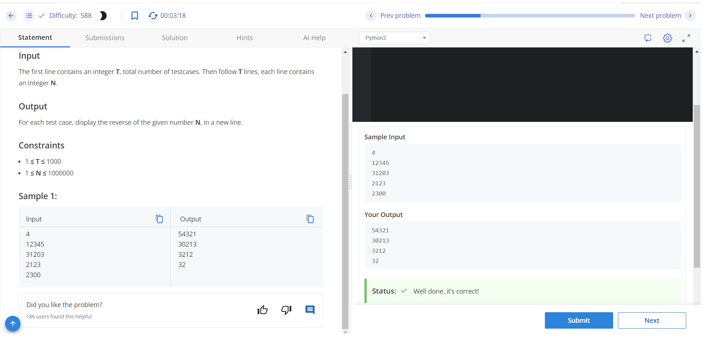
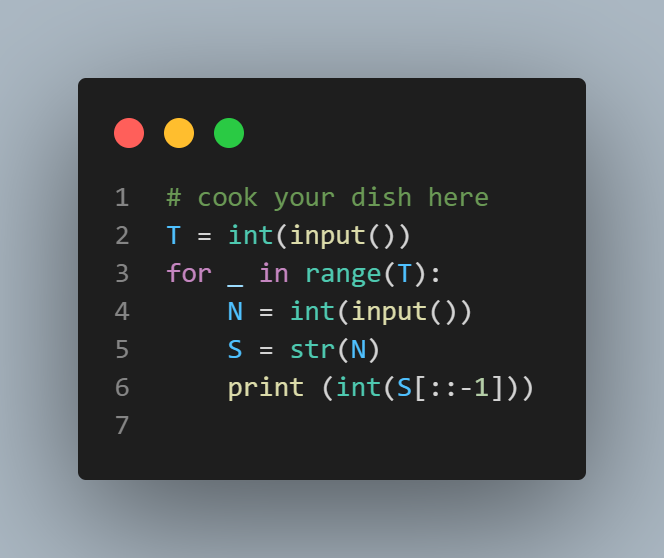

# Reverse The Number

## Problem Description

Given an Integer N, write a program to reverse it.

## Input Format

The first line contains an integer T, total number of test cases. Then follow T lines, each line contains an integer N.

## Output Format

For each test case, display the reverse of the given number N, in a new line.

## Constraints

1 ≤ T ≤ 1000
1 ≤ N ≤ 1000000

## Sample Input
```
4
12345
31203
2123
2300
```
## sample output
```
54321
30213
3212
32
```

