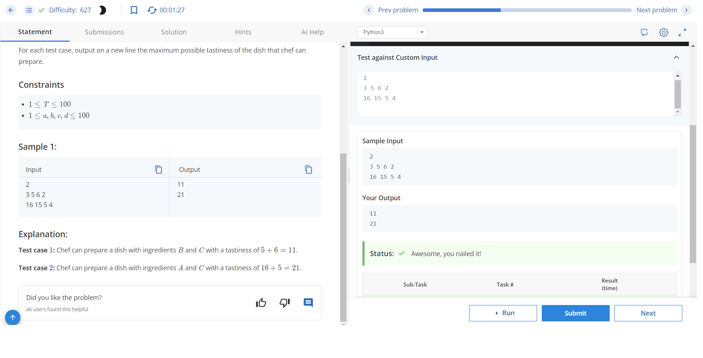
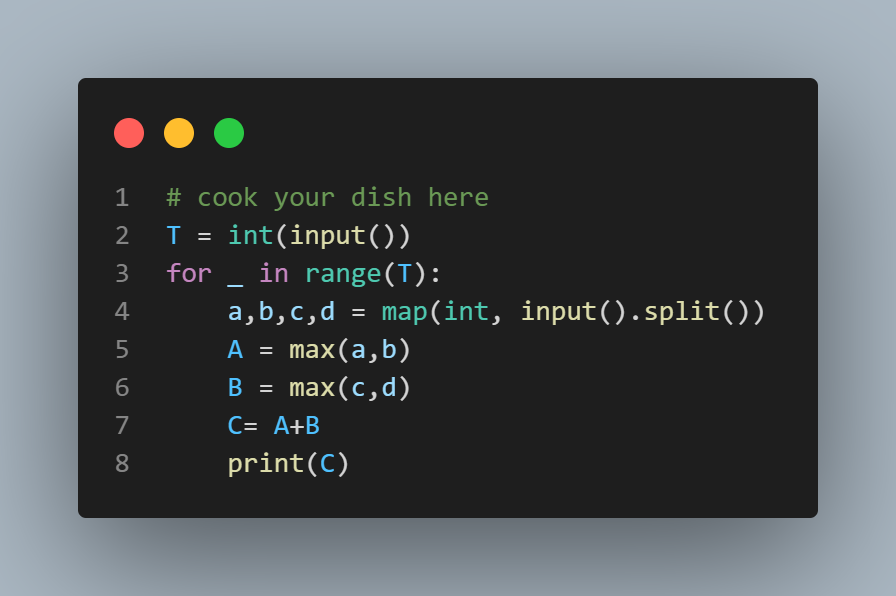

# Maximise the Tastiness Problem

## Problem Statement

Chef is making a dish that consists of exactly two ingredients. He has four ingredients A, B, C, D with tastiness a, b, c, and d respectively. He can use either A or B as the first ingredient and either C or D as the second ingredient.

The tastiness of a dish is the sum of the tastiness of its ingredients. Find the maximum possible tastiness of the dish that the chef can prepare.

### Input Format

The first line of input will contain a single integer T, denoting the number of test cases. Each test case consists of a single line of input containing four space-separated integers A, B, C, D — the tastiness of the four ingredients.

### Output Format

For each test case, output on a new line the maximum possible tastiness of the dish that chef can prepare.

### Constraints

- 1 ≤ T ≤ 100
- 1 ≤ A, B, C, D ≤ 100

### Sample Input

```2
3 5 6 2 
16 15 5 4
```
### sample output 
```
11
21
```


### Explanation

- Test case 1: Chef can prepare a dish with ingredients B and C with a tastiness of 5 + 6 = 11.
- Test case 2: Chef can prepare a dish with ingredients A and C with a tastiness of 16 + 5 = 21.

This README provides a clear explanation of the problem, input/output format, constraints, and a sample input/output with explanations.

