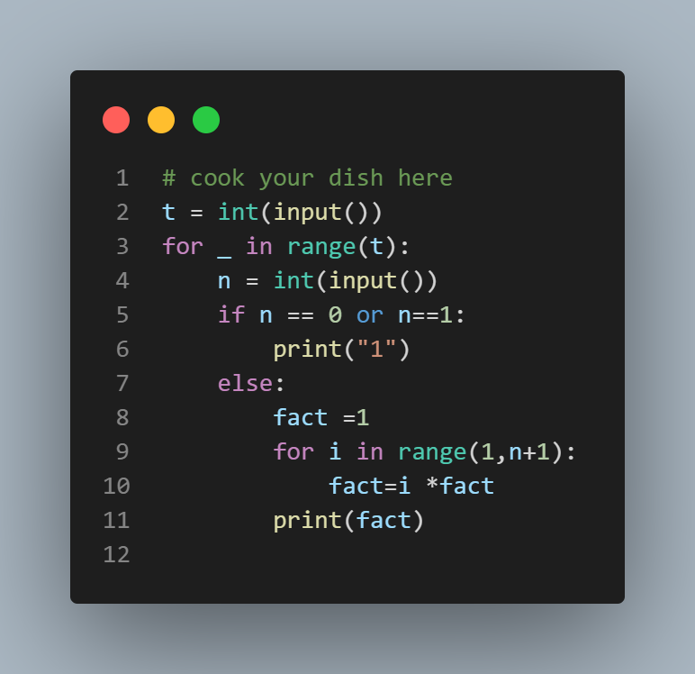

# Small Factorials Problem

## Problem Statement

You are asked to calculate factorials of some small positive integers.

### Input Format

An integer t, 1 ≤ t ≤ 100, denoting the number of test cases, followed by t lines, each containing a single integer n, 1 ≤ n ≤ 100.

### Output Format

For each integer n given at input, display a line with the value of n!

### Sample Input

```
4
1
2
5
3
```
### sample output
```
1
2
120
6
```


