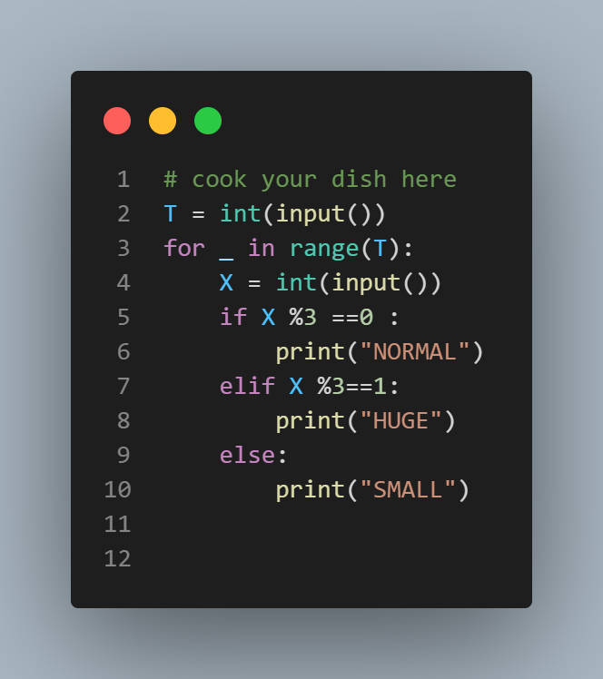

# Mario's Mushroom Muncher

## Problem Statement

Mario is a mushroom muncher. Whenever he eats a mushroom, he changes size according to the following rules:

- If he eats a mushroom for the first time, he becomes huge.
- If he eats a mushroom for the second time, he becomes small.
- If he eats a mushroom for the third time, he returns to his normal size.

You are given the number of mushrooms Mario eats. For each test case, determine Mario's final size after eating those mushrooms.

## Input

The input consists of multiple test cases. The first line contains an integer T (1 ≤ T ≤ 100), the number of test cases. Each test case contains an integer X (1 ≤ X ≤ 100), the number of mushrooms Mario eats.

## Output

For each test case, output in a single line Mario's size after eating X mushrooms:

- `NORMAL`, if his final size is normal.
- `HUGE`, if his final size is huge.
- `SMALL`, if his final size is small.

## Constraints

- 1 ≤ X ≤ 100

## Sample Input
```
3
2
4
12
```
## Sample output
```
SMALL
HUGE
NORMAL
```



