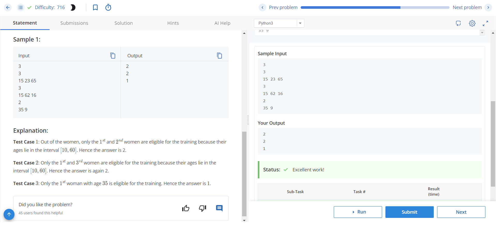
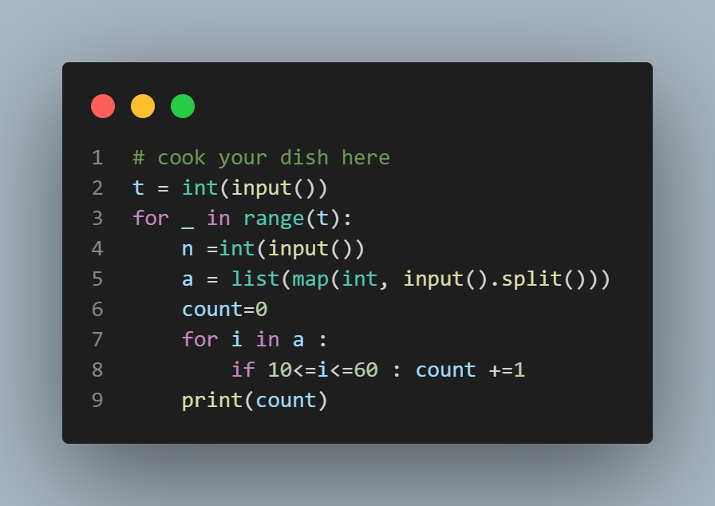

# Shaolin Self-Defence Training

## Problem Description
After the phenomenal success of the 36th Chamber of Shaolin, San Te has decided to start the 37th Chamber of Shaolin. This time, the aim is to equip women with Shaolin self-defence techniques. The only condition for a woman to be eligible for the special training is that she must be between 10 and 60 years of age, inclusive of both 10 and 60. Given the ages of N women in his village, San Te needs to find out how many of them are eligible for the special training.

## Input Format
- The first line of input contains a single integer T, denoting the number of test cases.
- For each test case:
  - The first line contains a single integer N, the number of women.
  - The second line contains N space-separated integers, the ages of the women.

## Output Format
- For each test case, output in a single line the number of women eligible for self-defence training.

## Constraints
- 1 ≤ T ≤ 20
- 1 ≤ N ≤ 100
- 1 ≤ Ai ≤ 100 (where Ai is the age of the ith woman)

## Sample Input
```

Sure, here's a README.md file for the problem:

markdown
Copy code
# Shaolin Self-Defence Training

## Problem Description
After the phenomenal success of the 36th Chamber of Shaolin, San Te has decided to start the 37th Chamber of Shaolin. This time, the aim is to equip women with Shaolin self-defence techniques. The only condition for a woman to be eligible for the special training is that she must be between 10 and 60 years of age, inclusive of both 10 and 60. Given the ages of N women in his village, San Te needs to find out how many of them are eligible for the special training.

## Input Format
- The first line of input contains a single integer T, denoting the number of test cases.
- For each test case:
  - The first line contains a single integer N, the number of women.
  - The second line contains N space-separated integers, the ages of the women.

## Output Format
- For each test case, output in a single line the number of women eligible for self-defence training.

## Constraints
- 1 ≤ T ≤ 20
- 1 ≤ N ≤ 100
- 1 ≤ Ai ≤ 100 (where Ai is the age of the ith woman)

## Sample Input
3
3
15 23 65
3
15 62 16
2
35 9


```


## Sample Output

```
2
2
1

```


## Explanation
- Test Case 1: Out of the women, only the 1st and 2nd women are eligible for the training because their ages lie in the interval [10, 60]. Hence the answer is 2.
- Test Case 2: Only the 1st and 3rd women are eligible for the training because their ages lie in the interval [10, 60]. Hence the answer is again 2.
- Test Case 3: Only the 1st woman with age 35 is eligible for the training. Hence the answer is 1.
 
 