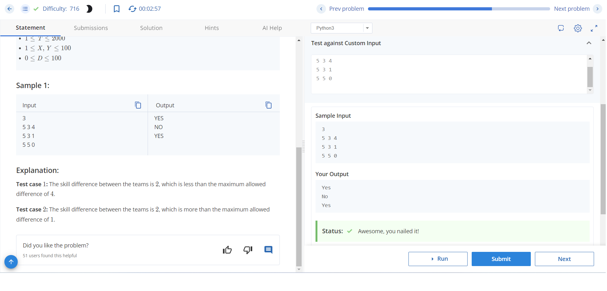
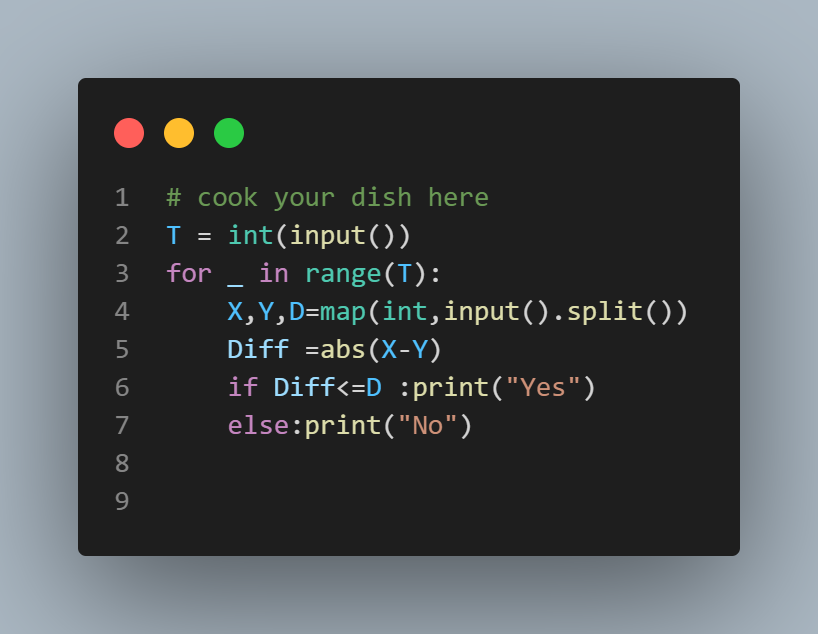

# Cup Finals

## Problem Description
It's the World Cup Finals, and Chef finds a match interesting only if the skill difference of the competing teams is less than or equal to D. Given the skills of the teams competing in the final as X and Y respectively, determine whether Chef will find the game interesting or not.

## Input Format
- The first line of input contains a single integer T, denoting the number of test cases.
- Each test case consists of a single line containing three space-separated integers X, Y, and D — the skill levels of the teams and the maximum skill difference.

## Output Format
- For each test case, output "YES" if Chef will find the game interesting, else output "NO" (case-insensitive).

## Constraints
- 1 ≤ T ≤ 2000
- 1 ≤ X, Y ≤ 100
- 0 ≤ D ≤ 100

## Sample Input
```

3
5 3 4
5 3 1
5 5 0
```

## sample output
```
YES
NO 
YES

```


## Explanation
- Test case 1: The skill difference between the teams is 2, which is less than the maximum allowed difference of 4.
- Test case 2: The skill difference between the teams is 2, which is more than the maximum allowed difference of 1.
- Test case 3: The skill difference between the teams is 0, which is less than the maximum allowed difference of 0.

