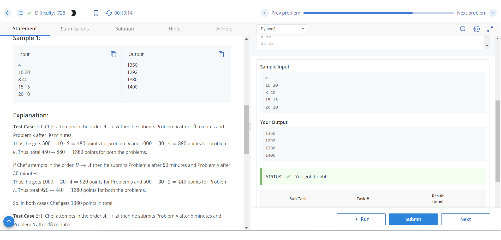

# A or B

## Problem Description
Chef is participating in a contest with two problems: Problem A and Problem B. Problem A is worth 500 points and Problem B is worth 1000 points at the start of the contest. After each minute, the maximum points of Problem A reduce by 2 points and the maximum points of Problem B reduce by 4 points. Given the time Chef requires to solve problems A and B, determine the maximum number of points Chef can score if he optimally decides the order of attempting both the problems.

## Input Format
- The first line contains an integer T, the number of test cases.
- Each of the next T lines contains two integers X and Y, the time required to solve problems A and B in minutes respectively.

## Output Format
- For each test case, output in a single line the maximum number of points Chef can score if he optimally decides the order of attempting both the problems.

## Constraints
- 1 ≤ T ≤ 1000
- 1 ≤ X, Y ≤ 100

## Sample Input
```

4
10 20
8 40
15 15
20 10
```

## Sample output
```
1360
1292
1380
1400

```

## Explanation
- Test Case 1: Chef can score 1360 points by attempting Problem B first and then Problem A.
- Test Case 2: Chef can score 1292 points by attempting Problem A first and then Problem B.
- Test Case 3: Chef can score 1380 points by attempting Problem B first and then Problem A.
- Test Case 4: Chef can score 1400 points by attempting Problem B first and then Problem A.

