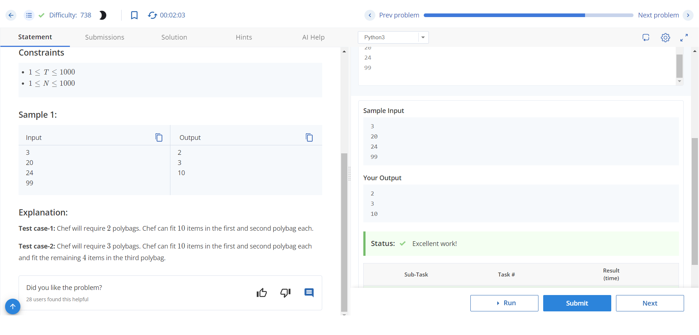
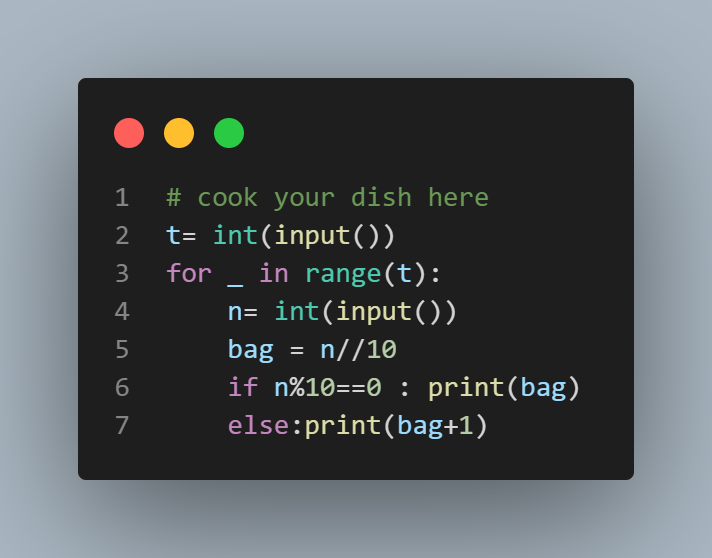

# Polybag Purchase

Chef bought N items from a shop. To carry these items more conveniently, Chef decides to buy some polybags. Each polybag can contain at most 10 items. This program calculates the minimum number of polybags needed by Chef.

## Input Format

The first line of the input contains an integer T - the number of test cases. Then the test cases follow.
Each test case consists of a single integer N, the number of items bought by Chef.

## Output Format

For each test case, the program outputs the minimum number of polybags required.

## Constraints

- 1 ≤ T ≤ 1000
- 1 ≤ N ≤ 1000

## Sample Input 

```
3
20
24
99

```
## Sample output 
```
2
3
10


```

## Explanation

- Test case 1: Chef will require 2 polybags. Chef can fit 10 items in the first and second polybag each.
- Test case 2: Chef will require 3 polybags. Chef can fit 10 items in the first and second polybag each, and fit the remaining 4 items in the third polybag.
- Test case 3: Chef will require 10 polybags. Chef can fit 10 items in each of the 9 polybags, and the remaining 9 items in the 10th polybag.



