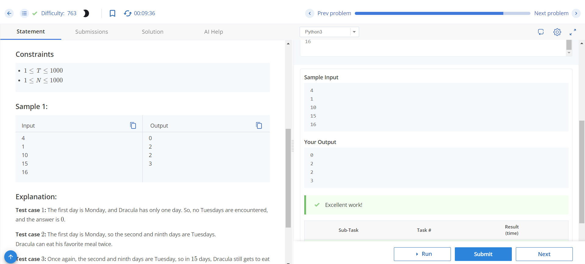

# Dracula Eats

## Problem Description
Dracula dines at a mysterious restaurant with a changing menu. He particularly enjoys what they serve on Tuesday. Given that today is Monday, and there are *N* spooky days left until Halloween, calculate how many times Dracula can indulge in his favorite menu in the next *N* days (including today).

## Input Format
- The first line contains an integer *T*, denoting the number of test cases.
- Each of the next *T* lines contains a single integer *N*, denoting the number of spooky days.

## Output Format
- For each test case, output on a new line the number of times Dracula would have had his favorite meal after *N* days.

## Constraints
- 1 ≤ *T* ≤ 1000
- 1 ≤ *N* ≤ 1000

## Sample Input
```
4
1
10
15
16
```

## sample output
```
0
2
2
3
```

## Explanation
- Test case 1: The first day is Monday, and Dracula has only one day. So, no Tuesdays are encountered, and the answer is 0.
- Test case 2: The first day is Monday, so the second and ninth days are Tuesdays. Dracula can eat his favorite meal twice.
- Test case 3: Once again, the second and ninth days are Tuesday, so in 15 days, Dracula still gets to eat his favorite meal only twice.
- Test case 4: After the ninth day, the 16th day is also a Tuesday. So, this time Dracula gets to eat his favorite meal three times - on days 2, 9, and 16.

