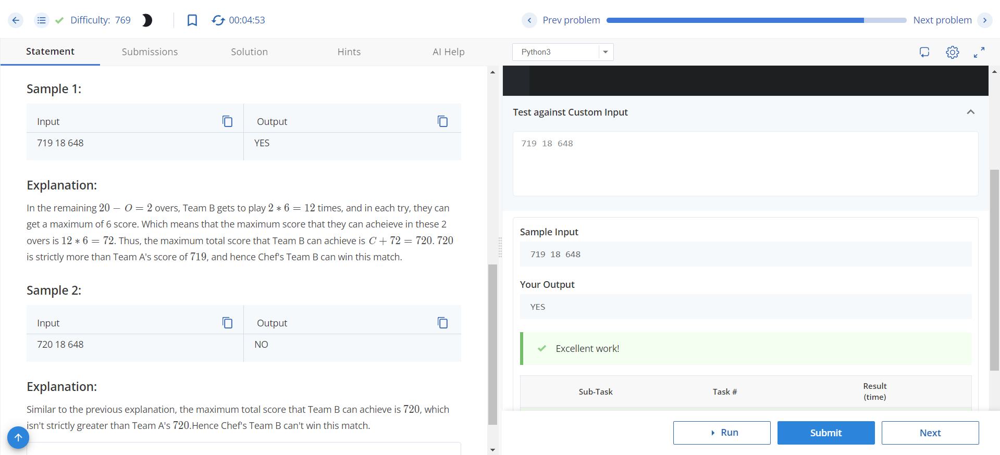
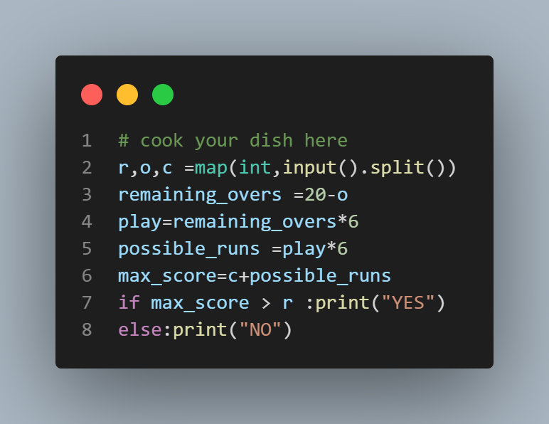

# Possible Victory

## Problem Description
In a T20 cricket match, Team A plays for 20 overs, and Team B tries to chase their score. Given the score of Team A (R), the number of overs Team B has already played (O), and the runs scored by Team B in those overs (C), determine whether it's possible for Chef's Team B to win the match.

## Input Format
- There is a single line of input containing three integers: R (Team A's score), O (number of overs already played by Team B), and C (runs scored by Team B in those overs).

## Output Format
- Output "YES" if it's possible for Chef's Team B to win the match, and "NO" otherwise.

## Constraints
- 0 ≤ C ≤ R ≤ 720
- 1 ≤ O ≤ 19
- 0 ≤ R ≤ 36 * O

## Sample Input
```719 18 648```

## sample output
``` YES ```


## Explanation
In the remaining 20 - O = 2 overs, Team B gets to play 2 * 6 = 12 times, and in each try, they can get a maximum of 6 runs. Thus, the maximum score that Team B can achieve in these 2 overs is 12 * 6 = 72. Hence, the maximum total score that Team B can achieve is C + 72 = 720. Since 720 is strictly more than Team A's score of 719, Chef's Team B can win this match.

## Sample Input
``` 720 18 648 ```

## sample output
```NO```

## Explanation
The maximum total score that Team B can achieve is 720, which isn't strictly greater than Team A's 720. Hence Chef's Team B can't win this match.


