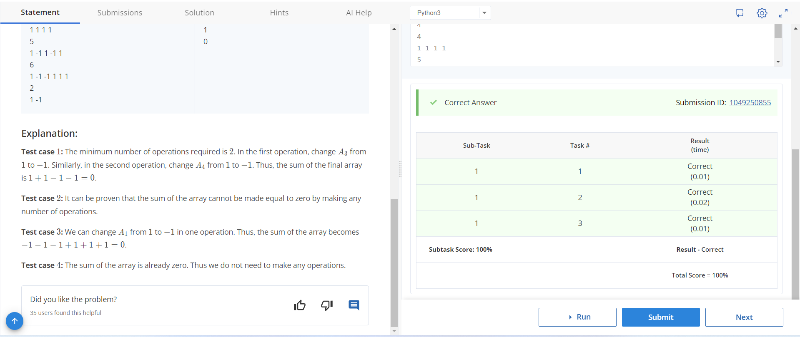
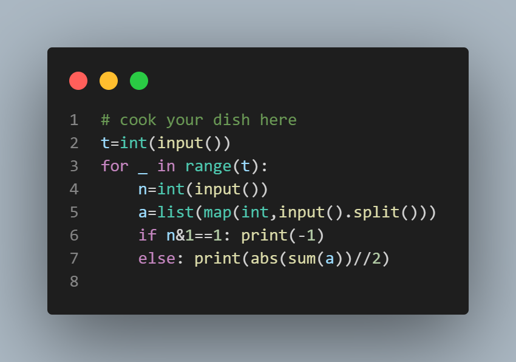

# Minimum Number of Flips

## Problem Description
Chef has an array A of length N consisting of 1 and -1 only. In one operation, Chef can choose any index i (1 ≤ i ≤ N) and multiply the element Ai by -1. Find the minimum number of operations required to make the sum of the array equal to 0. Output -1 if the sum of the array cannot be made 0.

## Input Format
- The first line contains T, the number of test cases.
- For each test case:
  - The first line contains a single integer N, the length of the array.
  - The second line contains N space-separated integers A1, A2, ..., AN denoting the array A.

## Output Format
For each test case, output the minimum number of operations to make the sum of the array equal to 0. Output -1 if it is not possible to make the sum equal to 0.

## Constraints
- 1 ≤ T ≤ 100
- 2 ≤ N ≤ 1000
- Ai = 1 or Ai = -1

## Sample Input


markdown
Copy code
# Minimum Number of Flips

## Problem Description
Chef has an array A of length N consisting of 1 and -1 only. In one operation, Chef can choose any index i (1 ≤ i ≤ N) and multiply the element Ai by -1. Find the minimum number of operations required to make the sum of the array equal to 0. Output -1 if the sum of the array cannot be made 0.

## Input Format
- The first line contains T, the number of test cases.
- For each test case:
  - The first line contains a single integer N, the length of the array.
  - The second line contains N space-separated integers A1, A2, ..., AN denoting the array A.

## Output Format
For each test case, output the minimum number of operations to make the sum of the array equal to 0. Output -1 if it is not possible to make the sum equal to 0.

## Constraints
- 1 ≤ T ≤ 100
- 2 ≤ N ≤ 1000
- Ai = 1 or Ai = -1

## Sample Input
```
4
4
1 1 1 1
5
1 -1 1 -1 1
6
1 -1 -1 1 1 1
2
1 -1
```

## Sample output
```2
-1
1
0
```

## Explanation
- Test case 1: The minimum number of operations required is 2. In the first operation, change A3 from 1 to -1. Similarly, in the second operation, change A4 from 1 to -1. Thus, the sum of the final array is 1 + 1 - 1 - 1 = 0.
- Test case 2: It can be proven that the sum of the array cannot be made equal to zero by making any number of operations.
- Test case 3: We can change A1 from 1 to -1 in one operation. Thus, the sum of the array becomes -1 - 1 - 1 + 1 + 1 + 1 = 0.
- Test case 4: The sum of the array is already zero. Thus we do not need to make any operations.

