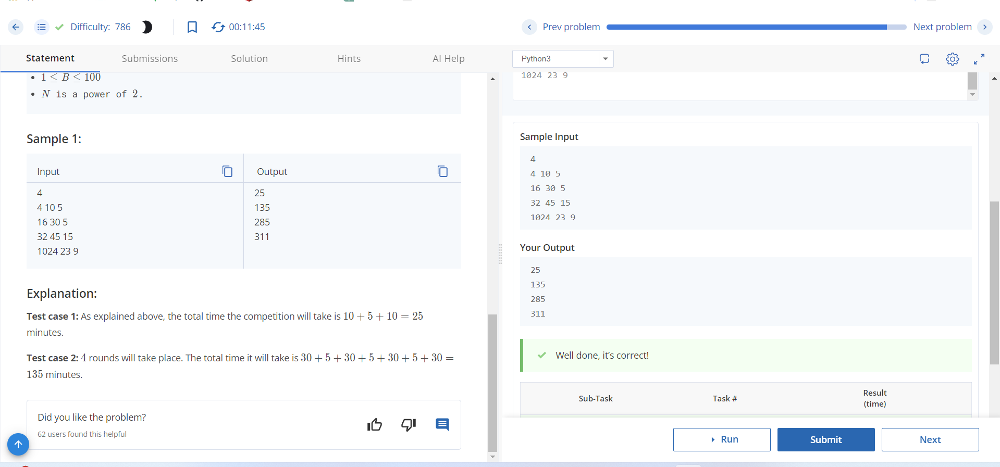
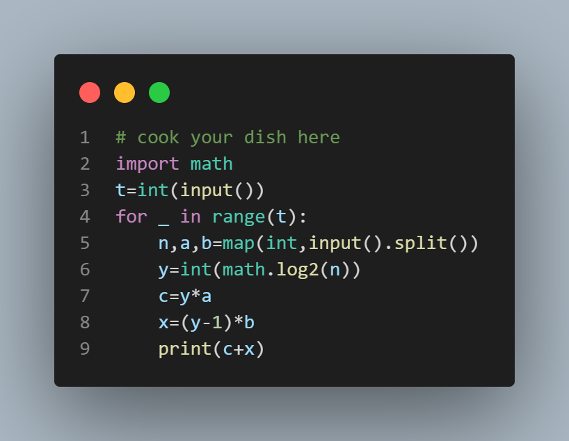

# Binary Battles

## Problem Description
N teams have come to participate in a competitive coding event called “Binary Battles”. It is a single-elimination tournament consisting of several rounds. In one round, each team will be paired up with and compete against one of the other teams. If there are X teams before the start of a round, 2^X matches are held simultaneously during the round between 2^X pairs of teams. The winning team of each match will move on to the next round, while the losing team of each match will be eliminated. There are no ties involved. The next round will then take place in the same format between the remaining teams. The process will continue until only one team remains, which will be declared the overall winner. The organizers want to find the total time the event will take to complete.

## Input Format
- The first line contains an integer T, denoting the number of test cases.
- For each test case:
  - The first and only line contains three space-separated integers N, A, and B respectively — the number of teams, the duration of each round, and the length of the breaks between rounds.

## Output Format
For each test case, output on a new line the time taken in minutes for the whole event to finish.

## Constraints
- 1 ≤ T ≤ 10^5
- 2 ≤ N ≤ 2^20
- 1 ≤ A ≤ 100
- 1 ≤ B ≤ 100
- N is a power of 2.

## Sample Input

```
4
4 10 5
16 30 5
32 45 15
1024 23 9

```
## Sample output
```
25
135
285
311

```


## Explanation
- Test case 1: The total time the competition will take is 10 + 5 + 10 = 25 minutes.
- Test case 2: 4 rounds will take place. The total time it will take is 30 + 5 + 30 + 5 + 30 + 5 + 30 = 135 minutes.



