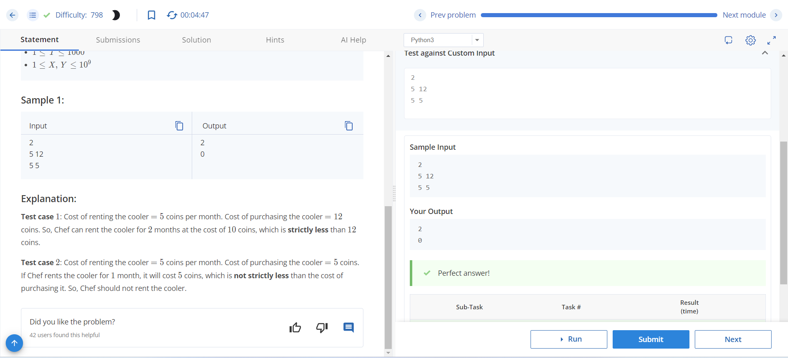

# The Cooler Dilemma 2

During the scorching summer days in Chefland, Chef is faced with a dilemma: whether to rent or purchase a water cooler to keep his room cool. With two available options - renting at a monthly cost of **X** coins or purchasing for **Y** coins - Chef seeks to determine the maximum number of months he can rent the cooler while ensuring that the cost of renting remains strictly less than the cost of purchasing.

## Input Format

- The first line of input contains an integer **T** — the number of test cases.
- Each of the next **T** lines describes a test case with two integers **X** and **Y**, representing the rental and purchase costs respectively.

## Output Format

For each test case, output the maximum number of months for which Chef can rent the cooler such that the cost of renting is strictly less than the cost of purchasing. If Chef should not rent a cooler at all, output **0**.

## Constraints

- \(1 \leq T \leq 1000\)
- \(1 \leq X, Y \leq 10^9\)

## Sample Input
```
2
5 12
5 5

```
## sample output
```
2
0
```

### Explanation

- **Test case 1**: With a rental cost of 5 coins per month and a purchase cost of 12 coins, Chef can rent the cooler for 2 months at a total cost of 10 coins, which is strictly less than the purchase cost of 12 coins.
- **Test case 2**: With the same rental and purchase costs of 5 coins, the rental cost for 1 month (5 coins) is not strictly less than the purchase cost. Hence, Chef should not rent the cooler.

