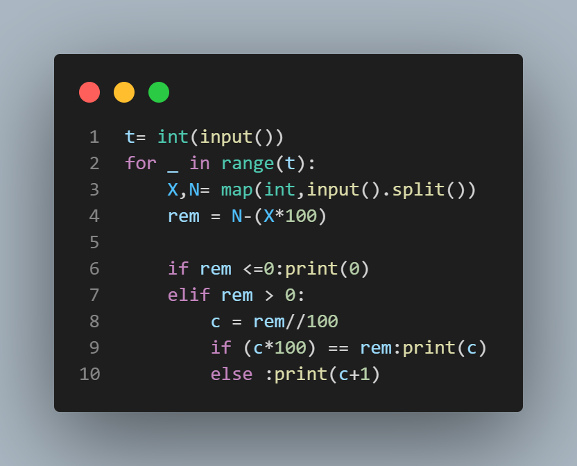

# Airlines

## Problem Statement
An airline operates X aircraft every day. Each aircraft can carry up to 100 passengers. One day, N passengers would like to travel to the same destination. What is the minimum number of new planes that the airline must buy to carry all N passengers?

## Input Format
- The first line of input will contain a single integer T, denoting the number of test cases.
- Each test case consists of a single line containing two space-separated integers X and N — the number of aircraft the airline owns and the number of passengers traveling, respectively.

## Output Format
- For each test case, output the minimum number of planes the airline needs to purchase.

## Constraints
- 1 ≤ T ≤ 1000
- 1 ≤ X ≤ 10^6
- 1 ≤ N ≤ 10^6

## Sample Input
```
3
4 600
3 523
8 245 
```

## sample output
```
2
3
0

```

## Explanation
- Test case 1: The airline needs at least 6 planes to carry 600 passengers. They already have 4, so they must purchase 2 more.
- Test case 2: The airline needs at least 6 planes to carry 523 passengers. They already have 3, so they must purchase 3 more.
- Test case 3: The airline needs at least 3 planes to carry 245 passengers. They already have 8, so there's no need to purchase any more.



