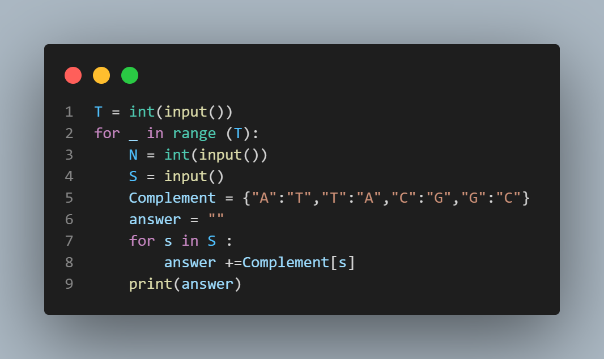

# Complementary Strand in a DNA

## Problem Description

You are given the sequence of Nucleotides of one strand of DNA through a string **S** of length **N**. **S** contains the characters A, T, C, and G only. Chef knows that:
- A is complementary to T.
- T is complementary to A.
- C is complementary to G.
- G is complementary to C.
Using the string **S**, determine the sequence of the complementary strand of the DNA.

## Input Format

The input consists of multiple test cases.
- The first line of input will contain **T**, the number of test cases.
- For each test case:
  - The first line contains an integer **N**, denoting the length of string **S**.
  - The second line contains **N** characters denoting the string **S**.

## Output Format

For each test case, output the string containing **N** characters - the sequence of nucleotides of the complementary strand.

## Constraints
- 1 ≤ T ≤ 100
- 1 ≤ N ≤ 100
- **S** contains A, T, C, and G only

## Sample Input
```
4
4
ATCG
4
GTCC
5 
AAAAA
3
TAC
```
## sample output
```
TAGC
CAGG
TTTTT
ATG
```
## Explanation
- Test case 1: The complements of A, T, C, and G are T, A, G, and C respectively. Thus, the complementary string of the given string ATCG is TAGC.
- Test case 2: The complements of G, T, and C are C, A, and G respectively. Thus, the complementary string of the given string GTCC is CAGG.
- Test case 3: The complement of A is T. Thus, the complementary string of the given string AAAAA is TTTTT.
- Test case 4: The complements of T, A, and C are A, T, and G respectively. Thus, the complementary string of the given string TAC is ATG.


