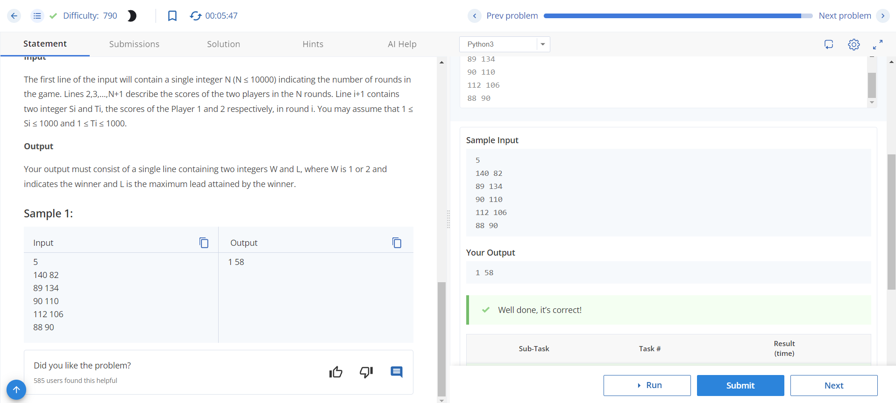

# The Lead Game

## Problem Description

The Siruseri Sports Club organizes an annual billiards game where the top two players of Siruseri play against each other. The Manager of Siruseri Sports Club decided to add his own twist to the game by changing the rules for determining the winner. In his version, at the end of each round, the cumulative score for each player is calculated, and the leader and her current lead are found. Once all the rounds are over, the player who had the maximum lead at the end of any round in the game is declared the winner.

## Input Format

- The first line of the input will contain a single integer N (N ≤ 10000) indicating the number of rounds in the game.
- Lines 2, 3, ..., N+1 describe the scores of the two players in the N rounds. Line i+1 contains two integers Si and Ti, the scores of Player 1 and Player 2 respectively, in round i. You may assume that 1 ≤ Si ≤ 1000 and 1 ≤ Ti ≤ 1000.

## Output Format

Your output must consist of a single line containing two integers W and L, where W is 1 or 2 and indicates the winner and L is the maximum lead attained by the winner.

## Sample Input

```
5
140 82
89 134
90 110
112 106
88 90
```
## sample output
``` 1 58 ```

## Explanation

In the provided sample, the game has 5 rounds. After each round, the cumulative scores and the lead are calculated. The winner is Player 1, who had a maximum lead of 58 points at the end of round 1.


