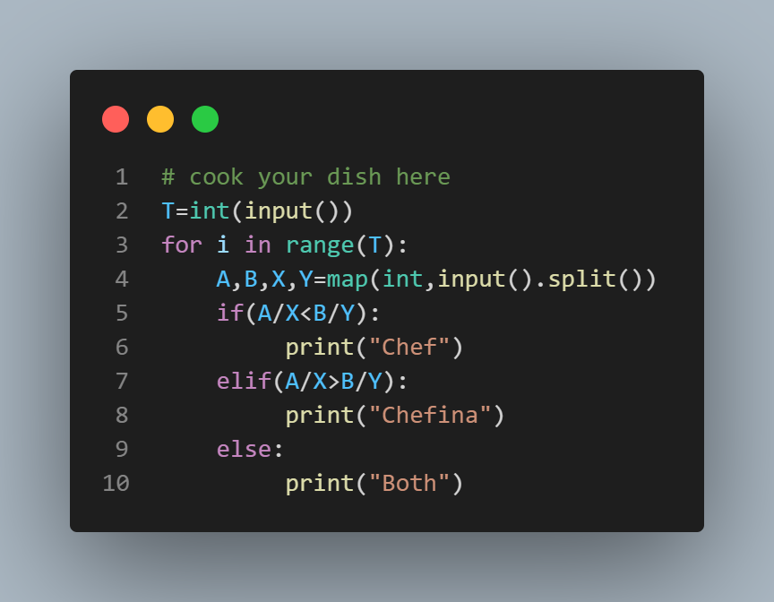

# Building Race

Two friends, Chef and Chefina, are on different floors of a building and want to reach the ground floor where prizes are being distributed. They have different speeds of descending the floors. This problem determines who will reach the ground floor first or if they will both reach it simultaneously.

## Problem Statement

Given the current floor of Chef and Chefina, along with their respective descending speeds, determine who will reach the ground floor first. If both reach it at the same time, print "Both".

### Input Format

The input consists of T test cases. The first line of each test case contains a single integer T, denoting the number of test cases. Each subsequent line contains four space-separated integers A, B, X, and Y, representing the current floor of Chef, the current floor of Chefina, Chef's descending speed, and Chefina's descending speed, respectively.

### Output Format

For each test case, output one of the following on a new line:
- "Chef" if Chef reaches the ground floor first.
- "Chefina" if Chefina reaches the ground floor first.
- "Both" if both reach the ground floor at the same time.

### Constraints

1 ≤ T ≤ 2500
1 ≤ A, B ≤ 100
1 ≤ X, Y ≤ 10

## sample Input

```
4
2 2 2 2
4 2 1 5
3 2 4 1
3 2 2 1

```
## sample output 

```
Both
Chefina
Chef
Chef
```

### Explanation

- Test case 1: Both Chef and Chefina reach the ground floor at the same time.
- Test case 2: Chefina reaches the ground floor first.
- Test case 3: Chef reaches the ground floor first.
- Test case 4: Chef reaches the ground floor first.


