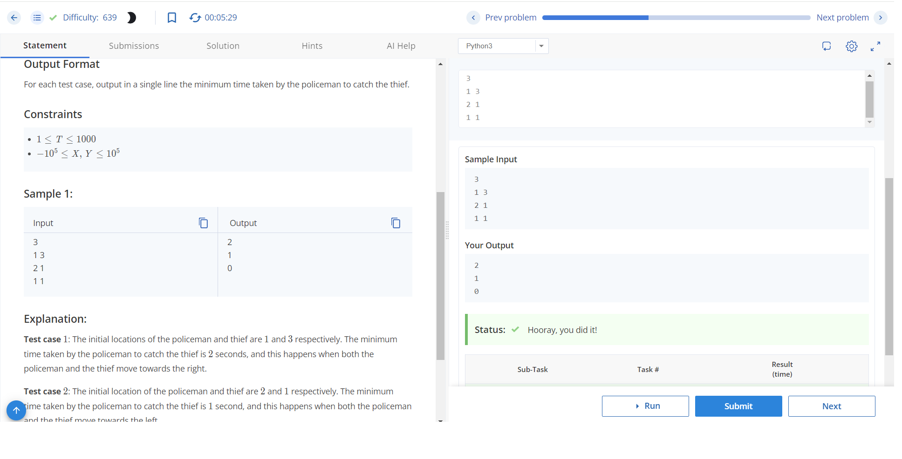

# Police and Thief Problem

## Problem Statement

Chef discovered that his secret recipe has been stolen. He immediately informs the police of the theft.

It is known that the policeman and thief move on the number line. You are given that:
- The initial location of the policeman on the number line is X, and his speed is 2 units per second.
- The initial location of the thief on the number line is Y, and his speed is 1 unit per second.

Find the minimum time (in seconds) in which the policeman can catch the thief. Note that the policeman catches the thief as soon as their locations become equal, and the thief will try to evade the policeman for as long as possible.

### Input Format

The first line of input will contain an integer T — the number of test cases. The description of T test cases follows. Each test case consists of a single line containing two integers X and Y, as described in the problem statement.

### Output Format

For each test case, output in a single line the minimum time taken by the policeman to catch the thief.

### Constraints

- 1 ≤ T ≤ 1000
- -10^5 ≤ X, Y ≤ 10^5

### Sample Input
```
3
13
21
11
```

### sample output
```
2
1
0
```
### Explanation

- Test case 1: The initial locations of the policeman and thief are 1 and 3, respectively. The minimum time taken by the policeman to catch the thief is 2 seconds, and this happens when both the policeman and the thief move towards the right.
- Test case 2: The initial locations of the policeman and thief are 2 and 1, respectively. The minimum time taken by the policeman to catch the thief is 1 second, and this happens when both the policeman and the thief move towards the left.
- Test case 3: The initial locations of the policeman and thief are both 1. Since the police is already present at the location of the thief, the time taken by police to catch the thief is 0 seconds.

This README provides a clear explanation of the problem, input/output format, constraints, and a sample input/output with explanations.

