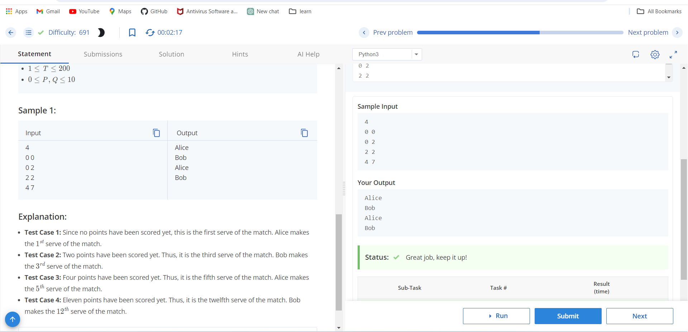

# It is My Serve

Alice and Bob are playing a game of table tennis where irrespective of the point scored, every player makes 2 consecutive serves before the service changes. Alice makes the first serve of the match. Therefore, the first 2 serves will be made by Alice, then the next 2 serves will be made by Bob and so on.

## Input Format
- First line: Number of test cases, T
- For each test case:
  - First line: Two integers P and Q — the score of Alice and Bob respectively.

## Output Format
For each test case, determine which player's (Alice or Bob) serve it is.

You may print each character of Alice and Bob in uppercase or lowercase (for example, Bob, BOB, boB will be considered identical).

## Constraints
- 1 ≤ T ≤ 200
- 0 ≤ P, Q ≤ 10

## Sample Input
```
4
0 0 
0 2 
2 2
4 7
```
## sample output
```
Alice 
Bob
Alice 
Bob
```

