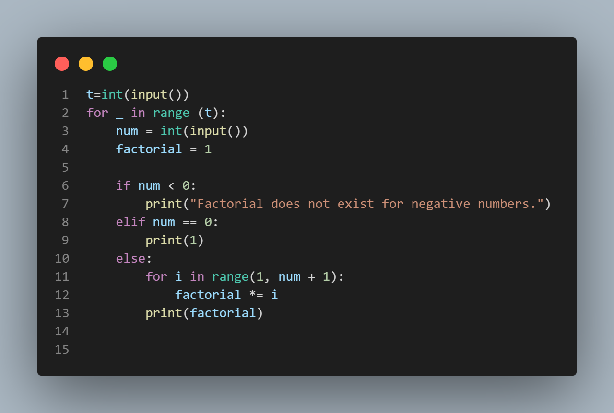

# Small Factorial

This program calculates the factorial value of any number entered by the user.

## Input Format

The first line contains an integer T, the total number of test cases. Then T lines follow, each line containing an integer N.

## Output Format

For each test case, the program displays the factorial of the given number N in a new line.

## Constraints

- 1 ≤ T ≤ 1000
- 0 ≤ N ≤ 20

## Sample Input

```
3 
3 
4
5
```
## sample output
```
6
24
120
```


