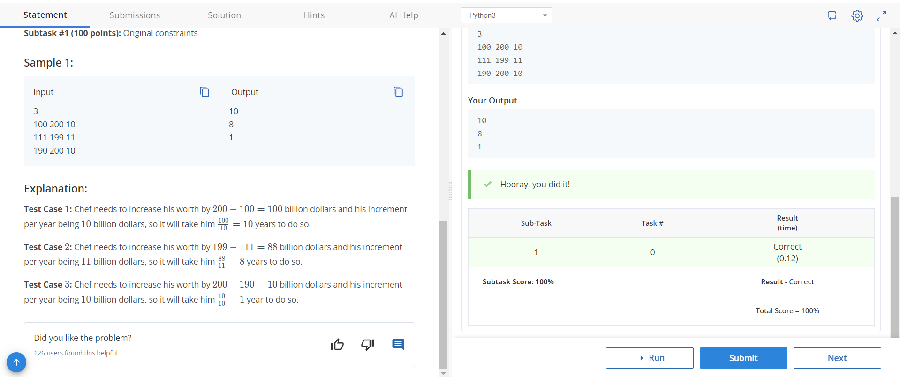

# Richie Rich

Chef aims to be the richest person in Chefland by his new restaurant franchise. Currently, his assets are worth A billion dollars and have no liabilities. He aims to increase his assets by X billion dollars per year.

Also, all the richest people in Chefland are not planning to grow and maintain their current worth.

To be the richest person in Chefland, he needs to be worth at least B billion dollars. How many years will it take Chef to reach his goal if his value increases by X billion dollars each year?

## Input
The first line contains an integer T, the number of test cases. Then the test cases follow.
Each test case contains a single line of input, three integers A, B, X.

## Output
For each test case, output in a single line the answer to the problem.

## Constraints
- 1 ≤ T ≤ 21,000
- 100 ≤ A < B ≤ 200
- 1 ≤ X ≤ 50
- X divides B - A

