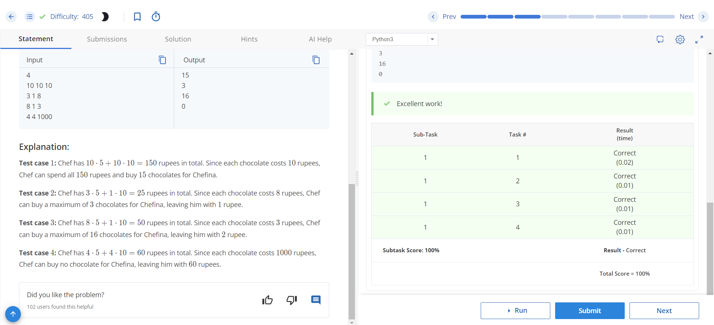

# Chef and Chocolates

This is a Python program to solve the "Chef and Chocolates" problem.

## Problem Description

Chef has X 5 rupee coins and Y 10 rupee coins. Chef goes to a shop to buy chocolates for Chefina where each chocolate costs Z rupees. The task is to find the maximum number of chocolates that Chef can buy for Chefina.

### Input Format

The first line contains a single integer T — the number of test cases. Then the test cases follow.
The first and only line of each test case contains three integers X, Y, and Z — the number of 5 rupee coins, the number of 10 rupee coins, and the cost of each chocolate.

### Output Format

For each test case, output the maximum number of chocolates that Chef can buy for Chefina.

### Constraints

- 1 ≤ T ≤ 100
- 1 ≤ X, Y, Z ≤ 1000

