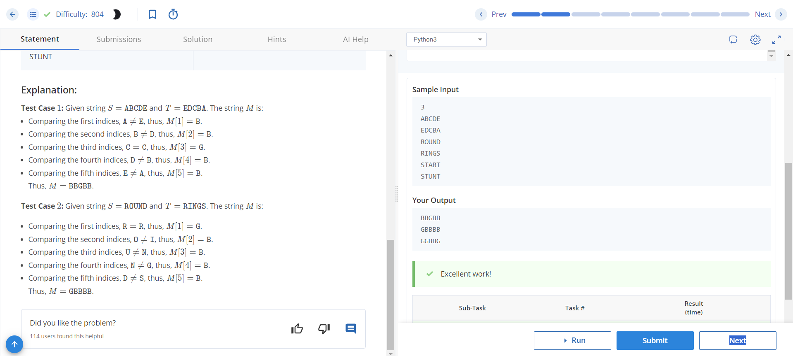

# Wordle Game

## Problem Statement

Chef has invented a modified version of the popular game Wordle. In this game, there is a hidden word S and a guess word T, both of length 5. Chef defines a string M to determine the correctness of the guess word. For each index i:

- If the guess at the i-th index is correct, the i-th character of M is 'G'.
- If the guess at the i-th index is wrong, the i-th character of M is 'B'.

Given the hidden word S and guess T, determine the string M.

## Input Format

- The first line contains T, the number of test cases.
- For each test case:
  - The first line contains the string S - the hidden word.
  - The second line contains the string T - the guess word.

## Output Format

For each test case, print the value of string M.

## Constraints

- 1 ≤ T ≤ 1000
- ∣S∣ = ∣T∣ = 5
- S, T contain uppercase English alphabets only.

## Sample Input
3
ABCDE
EDCBA
ROUND
RINGS
START
STUNT

## sample output

markdown
Copy code
# Wordle Game

## Problem Statement

Chef has invented a modified version of the popular game Wordle. In this game, there is a hidden word S and a guess word T, both of length 5. Chef defines a string M to determine the correctness of the guess word. For each index i:

- If the guess at the i-th index is correct, the i-th character of M is 'G'.
- If the guess at the i-th index is wrong, the i-th character of M is 'B'.

Given the hidden word S and guess T, determine the string M.

## Input Format

- The first line contains T, the number of test cases.
- For each test case:
  - The first line contains the string S - the hidden word.
  - The second line contains the string T - the guess word.

## Output Format

For each test case, print the value of string M.

## Constraints

- 1 ≤ T ≤ 1000
- ∣S∣ = ∣T∣ = 5
- S, T contain uppercase English alphabets only.

## Sample Input

3
ABCDE
EDCBA
ROUND
RINGS
START
STUNT

shell
Copy code

## Sample Output

BBGBB
GBBBB
GGBBG

## Explanation

- Test Case 1: Given S = "ABCDE" and T = "EDCBA", the string M is "BBGBB".
- Test Case 2: Given S = "ROUND" and T = "RINGS", the string M is "GBBBB".
- Test Case 3: Given S = "START" and T = "STUNT", the string M is "GGBBG".

## Instructions

- Input the number of test cases.
- For each test case, input the hidden word S and the guess word T.
- Output the string M for each test case.

## Constraints Clarification

- The number of test cases (T) should be between 1 and 1000.
- The lengths of hidden word S and guess word T are both 5.
- The hidden word S and guess word T contain only uppercase English alphabets.

