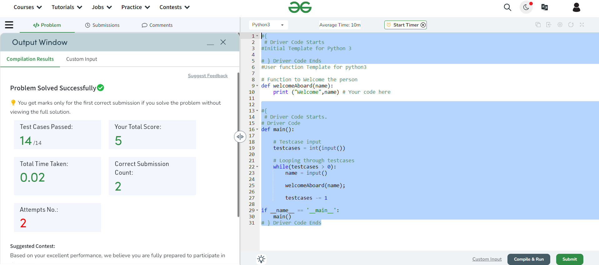

# Welcome Message

## Problem Statement
This module focuses on working with strings in Python. Strings in Python are immutable, meaning they cannot be changed after they are created. In this exercise, we are tasked with creating a welcome message for a person. The program should take the name of the person as input and output a welcome message that includes the person's name.

## Input
The input consists of a single line containing the name of the person.

## Output
The program should output a welcome message that includes the person's name.

## Constraints
- 1 <= |name| <= 100


### Input
```John```
### output
``` Welcome John```

## Explanation
- In the first example, the input name is "John", so the output is "Welcome John".
- In the second example, the input name is "Python", so the output is "Welcome Python".

