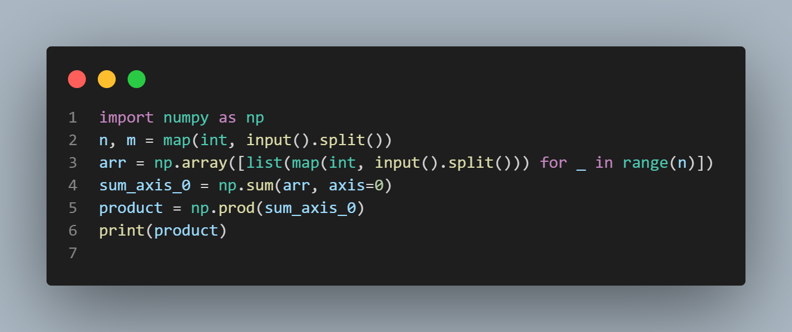

# HackerRank - Python Numpy: Sum and Prod

## Problem Description

This problem involves using NumPy's `sum` and `prod` functions. 

The `sum` function returns the sum of array elements over a given axis, while the `prod` function returns the product of array elements over a given axis. By default, both functions perform the operation over all the dimensions of the input array when the axis value is set to None.

## Task

You are given a 2-D array with dimensions X. Your task is to perform the `sum` tool over a specific axis and then find the `prod` of that result.

## Input Format

The first line of input contains space-separated values of n and m, representing the dimensions of the 2-D array.
The next n lines contain m space-separated integers representing the elements of the array.

## Output Format

Compute the sum along a specific axis. Then, print the product of that sum.

## Sample Input

2 2
1 2
3 4

## Sample Output

24

## Explanation

The sum along the axis = [ ]
The product of this sum = 24

