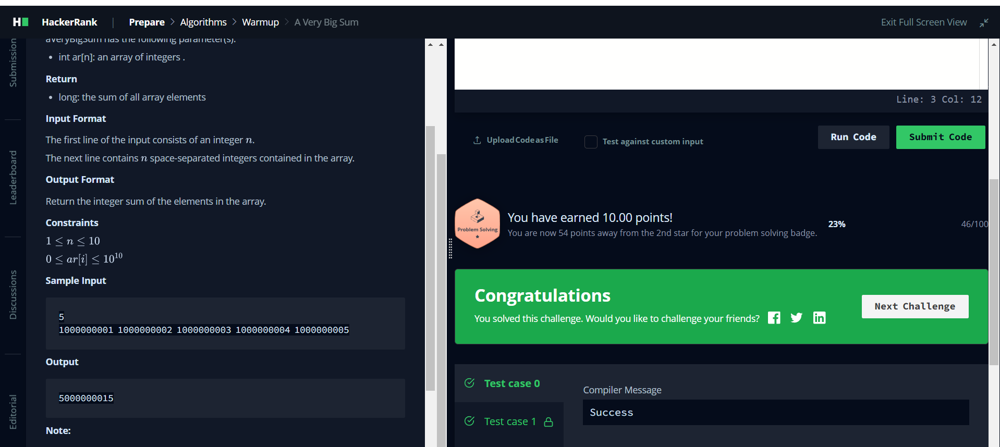
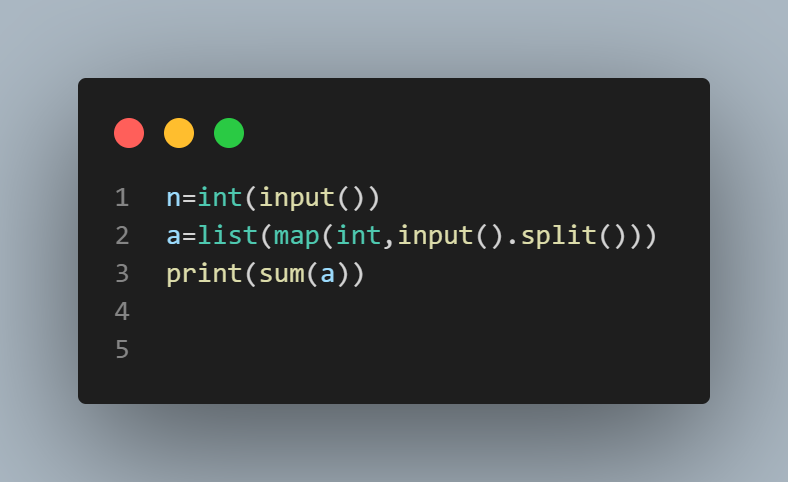

# Sum of Array Elements (Big Integers)

In this challenge, you are required to calculate and print the sum of the elements in an array, keeping in mind that some of those integers may be quite large.

## Function Description

Complete the `aVeryBigSum` function. It must return the sum of all array elements.

`aVeryBigSum` has the following parameter(s):

- `int ar[n]`: an array of integers

### Return

`long`: the sum of all array elements

## Input Format

The first line of the input consists of an integer `n`.
The next line contains `n` space-separated integers contained in the array.

## Output Format

Return the integer sum of the elements in the array.

### Constraints

- The range of the 32-bit integer is 231 - 1.
- When we add several integer values, the resulting sum might exceed the above range. You might need to use `long int` (C/C++) or `long` (Java) to store such sums.

## Sample Input
5
1000000001 1000000002 1000000003 1000000004 1000000005

## sample output

Certainly! Below is the README content in Markdown format for the given challenge:

markdown
Copy code
# Sum of Array Elements (Big Integers)

In this challenge, you are required to calculate and print the sum of the elements in an array, keeping in mind that some of those integers may be quite large.

## Function Description

Complete the `aVeryBigSum` function. It must return the sum of all array elements.

`aVeryBigSum` has the following parameter(s):

- `int ar[n]`: an array of integers

### Return

`long`: the sum of all array elements

## Input Format

The first line of the input consists of an integer `n`.
The next line contains `n` space-separated integers contained in the array.

## Output Format

Return the integer sum of the elements in the array.

### Constraints

- The range of the 32-bit integer is 231 - 1.
- When we add several integer values, the resulting sum might exceed the above range. You might need to use `long int` (C/C++) or `long` (Java) to store such sums.

## Sample Input

5
1000000001 1000000002 1000000003 1000000004 1000000005

## sample  Output

5000000015

